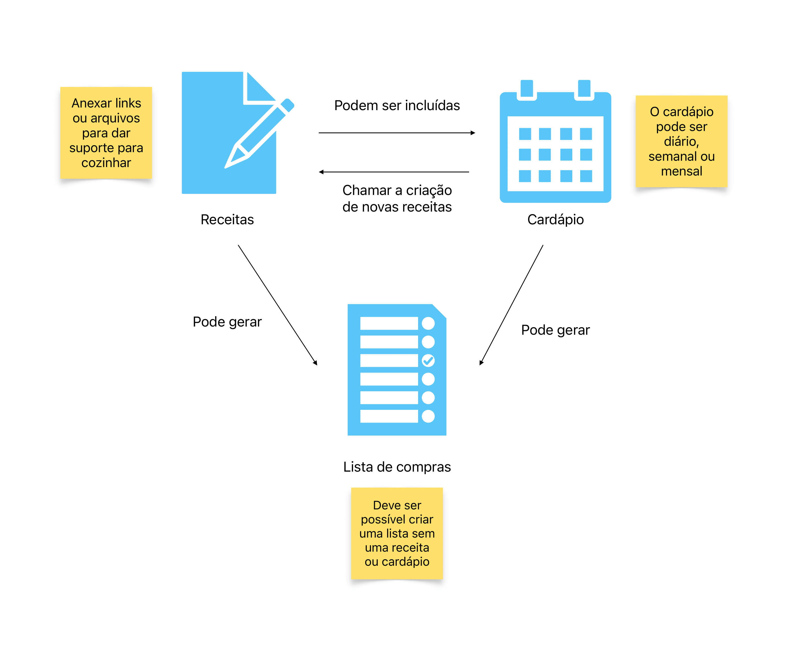

<h1 align="center">
    Treinamento de arquitetura
</h1>

<h4 align="center">
  Criando uma arquitetura com diversos conceitos aprendidos no programa eleve.elas
</h4>

  

  

  

  
  

  

<h2>Ideia da aplicação</h2>

<h2>Arquitetura da aplicação</h2>

